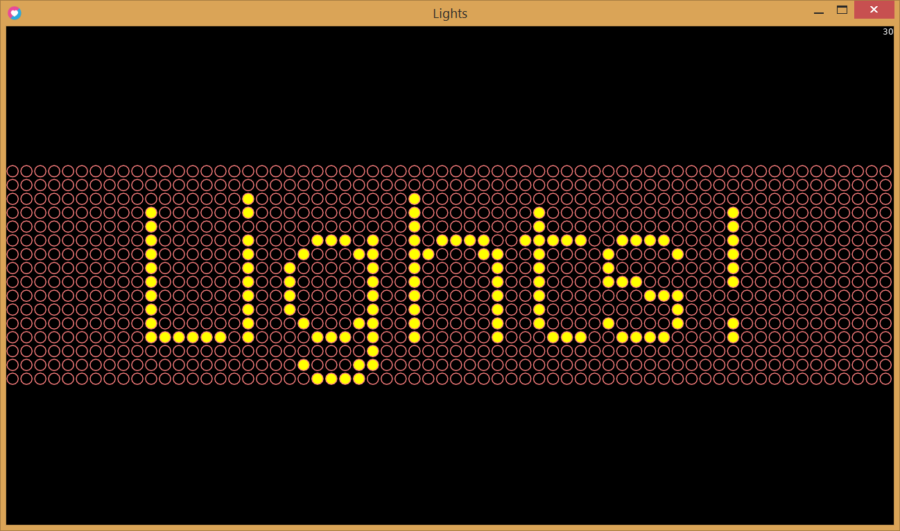

## Name

Lights

## Description

Light show written in [LÖVE](https://love2d.org/).

## Installation

1. Download and install LÖVE from https://love2d.org/.
2. Clone the repo
   ```sh
   git clone https://github.com/sshock/lights.git
   ```

## Usage

To start the example light show simply drag the lights folder onto the love executable or run `path/to/love.exe path/to/lights` from a terminal/cmdline.

To customize the light show, modify messages/example.txt or create your own txt file and run love with an extra parameter that is the path to it.

See [Getting Started](https://love2d.org/wiki/Getting_Started#Running_Games) and [Game Distribution](https://love2d.org/wiki/Game_Distribution) on love2d.org for more details,
including how to turn lights into a stand-alone executable.

### While running

* Press F to toggle fullscreen
* Press F1 to toggle FPS
* Press ESC to exit

To allow for faster FPS, change `t.window.vsync` to 0 in conf.lua and restart.

### Screenshot



## Actions

* C - Clear
* W - Wait (seconds)
* F - Set font
* LC - Set light color
* DC - Set dark color
* OC - Set outline color
* FPS - Set speed in FPS
* S - Show word
* SL - Scroll left word/phrase
* SR - Scroll right word/phrase
* SU - Scroll up word
* SD - Scroll down word

### Not implemented yet

* E - Explode word
* I - Implode word
* R - Random sparkle word
* HI - Horz In word
* HO - Horz Out word
* VI - Vert In word
* VO - Vert Out word
* LL - Line left word
* LR - Line right word
* LU - Line up word
* LD - Line down word

## Contribute

Contributions are welcome.  There are several actions that have not been implemented yet.

## License

Public domain. See `LICENSE` for more information.

